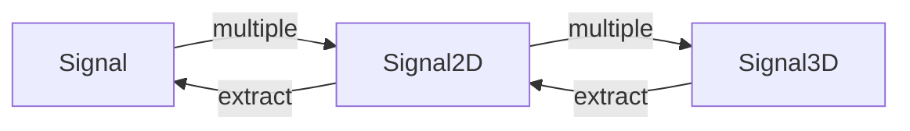
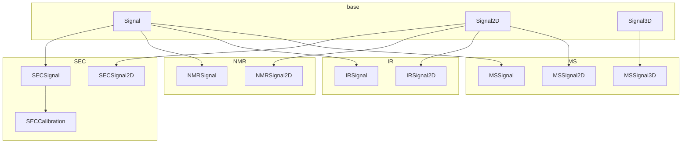
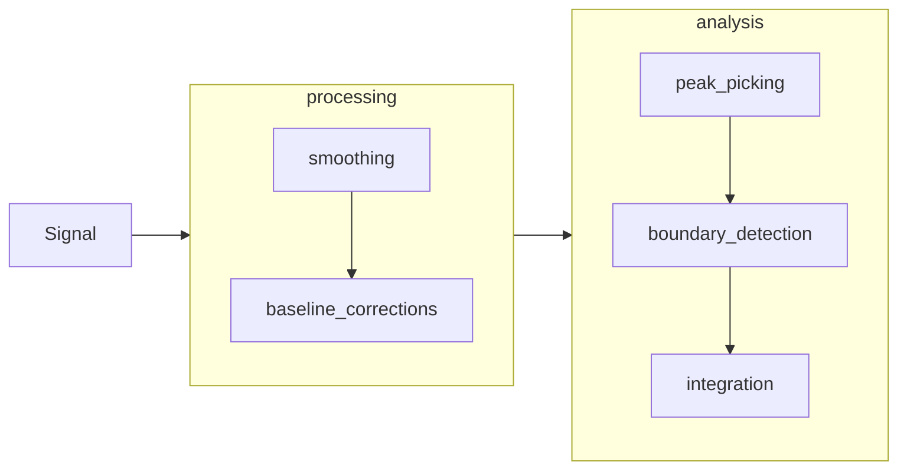

# High level structure of analysis

```mermaid
flowchart LR
    Signal --multiple--> Signal2D
    Signal2D --extract--> Signal
    Signal2D --multiple--> Signal3D
    Signal3D --extract--> Signal2D
```

```mermaid
flowchart TB
    subgraph base
    Signal 
    Signal2D
    Signal3D
    end

    subgraph SEC
    Signal --> SECSignal
    Signal2D --> SECSignal2D
    SECSignal --> SECCalibration 
    end

    subgraph NMR
    Signal --> NMRSignal
    Signal2D --> NMRSignal2D
    end

    subgraph IR
    Signal --> IRSignal
    Signal2D --> IRSignal2D
    end

    subgraph MS
    Signal --> MSSignal
    Signal2D --> MSSignal2D
    Signal3D --> MSSignal3D
    end
```

```mermaid
flowchart LR
    subgraph processing
        smoothing --> baseline_corrections
    end

    subgraph analysis
        peak_picking --> boundary_detection --> integration
    end

    Signal --> processing --> analysis
```