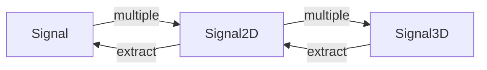
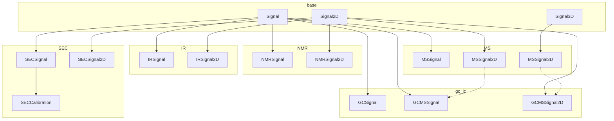
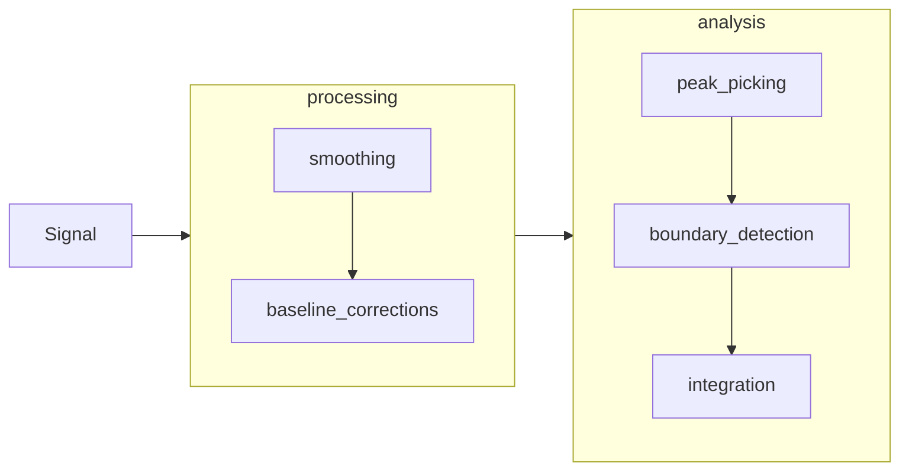

# High level structure of analysis

* `unify_method` is used to convert mutiple signals into a 1D higher dimension. If the singals are all similar than the `unify_method` may only combine the data. However, if signals are all not uniform (same exactly the axis, data point for data point) then the `unify_method` may need to expand or cut or linearly interpolate to make a uniform axis. 

## Important Notes
- When indexing; the first index referses to the outer value
- Data is always stored in sorted order (small to large)
  - Adjust order in plotting, if data is typically presented in reverse.